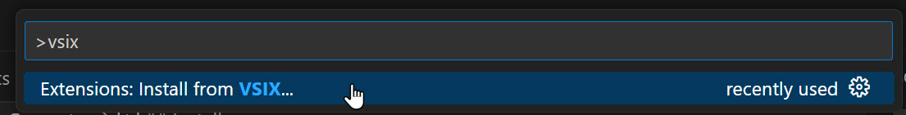
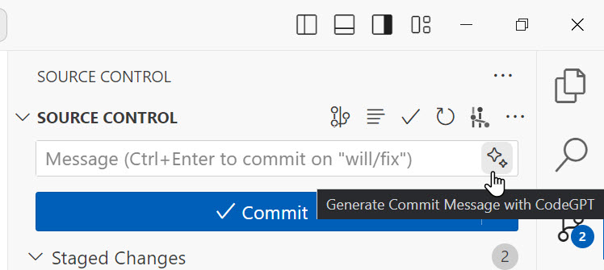

# CodeGPT: AI-Assisted Git Commit Message Generator

This VS Code extension use the [CodeGPT](https://github.com/appleboy/CodeGPT) CLI tool that generate git commit messages for you using ChatGPT AI (`gpt-3.5-turbo`, `gpt-4` model) right in the SCM inputBox.

## Install

1. Install [Visual Studio Code Insiders](https://code.visualstudio.com/insiders/)

    It because this extension used the `contribSourceControlInputBoxMenu` [Proposed API](https://code.visualstudio.com/api/advanced-topics/using-proposed-api). So you can only install and use the extension in VS Code 1.85+ which is Insider version for now.

    After the `contribSourceControlInputBoxMenu` proposed API been released, the extension will publish to the VS Code Marketplace.

2. Download [codegpt-0.1.0.vsix](https://github.com/doggy8088/vscode-codegpt/releases/download/0.1.0/codegpt-0.1.0.vsix)

3. Use `Extensions: Install from VSIX` command to install the VSIX.

    

4. Start VS Code Insider by passing `--enable-proposed-api doggy8088.codegpt` to the arguments.

    ```sh
    code-insiders --enable-proposed-api doggy8088.codegpt
    ```

## Usage

You can simply hit the button beside the Message field of the SCM pane in the Visual Studio Code.



Then then `codegpt commit --preview` will run and filled the generated message in the input box.

## Limitation

This extension is highly dependant with [CodeGPT](https://github.com/appleboy/CodeGPT) CLI tool. You have to install [CodeGPT](https://github.com/appleboy/CodeGPT) and fully configured first. Please make sure `codegpt` executable path is in your `PATH` environment variable.

## Options

TODO

## Links

- Visual Studio Code Extension API
  - [VS Code API](https://code.visualstudio.com/api/references/vscode-api)
  - [Source Control API](https://code.visualstudio.com/api/extension-guides/scm-provider#scm-input-box)
  - [Using Proposed API](https://code.visualstudio.com/api/advanced-topics/using-proposed-api)
    - [vscode.proposed.contribSourceControlInputBoxMenu.d.ts](https://github.com/microsoft/vscode/blob/main/src/vscode-dts/vscode.proposed.contribSourceControlInputBoxMenu.d.ts)
- StackOverflow
  - [vscode extensions - How do I create a custom button in the git Message field of the VS Code Source Control tab? - Stack Overflow](https://stackoverflow.com/a/77595771/910074)
- GitHub
  - [SCM: When multiple `scm/inputBox` been registered, the button shifted · Issue #199921 · microsoft/vscode](https://github.com/microsoft/vscode/issues/199921)
  - [SourceControl - SourceControlInputBoxValueProvider API proposal · Issue #195474 · microsoft/vscode](https://github.com/microsoft/vscode/issues/195474)
  - [SourceControl - `scm/inputBox` menu proposal (#195475) · Alex0007/vscode@6e87542](https://github.com/Alex0007/vscode/commit/6e87542ae69913b011f13f980683979fa7c94a04)